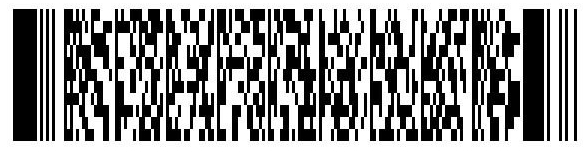

## Način plaćanja

Plaćanje naših usluga moguće je izvršiti:

- **Gotovinom** po završetku termina,
- **Bankovnim prijenosom** prije održavanja termina.

U nastavku su podaci za uplatu putem internet ili mobilnog bankarstva:

- **Primatelj/Poslovni subjekt:**  *DIDAKTRA, vl. Filip Reščić*

- **IBAN:**  HR25 2360 0001 1032 0536 4

- **Banka:**  *Zagrebačka banka d.d.* (**SWIFT:**  *ZABAHR2X*)

- **Poziv na broj:**  *datum uplate* (format dd-mm-yyyy, npr. 01-05-2025)

- **Opis plaćanja:**  *Poduke – ime učenika* (npr. Poduke - Ivo Ivić)

Barkod:

---

U slučaju da je uplata izvršena neposredno pred termin molimo vas da nam potvrdu o uplati pošaljete na e-mail: [info@didaktra.com](mailto:info@didaktra.com).
